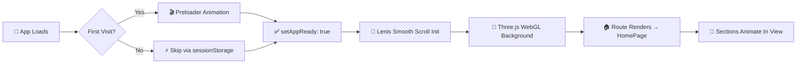

<div align="center">

<!-- Animated Header Banner -->


<!-- Animated Title -->
<a href="https://github.com/Parthparthu">
  
</a>

<br/>

<!-- Status & Info Badges -->
<a href="https://github.com/Parthparthu">
  
</a>


<br/><br/>

<!-- Visitor & Stars -->


</div>

---

## ⚡ Quick Links

<div align="center">

| 🌐 Live Portfolio | 📂 Projects | 💼 LinkedIn | 📧 Contact |
|:---:|:---:|:---:|:---:|
| **[Visit Site →](https://parthparthu.github.io)** | **[Browse All →](https://parthparthu.github.io/projects)** | **[Connect →](https://linkedin.com/in/pradyumna)** | **[Email →](mailto:contact@pradyumna.dev)** |

</div>

---

<div align="center">

## 🌌 About the Portfolio

</div>

> *"Building software from first principles — understanding how data flows at the protocol level, while obsessing over client performance, accessibility, and intuitive interaction."*

This is **Pradyumna's personal developer portfolio** — a production-grade, animated, offline-ready web application built with cutting-edge tools. It showcases flagship projects, engineering skills, and a full interactive experience — not just a static page, but a **living demonstration of technical craft**.

---

<div align="center">

## ✨ Features

</div>

<table>
<tr>
<td width="50%">

### 🎨 Visual & UX

| Feature | Description |
|---|---|
| 🌌 **3D Interactive Background** | Dynamic constellation & nebula particle field rendered via `Three.js` + `WebGL` |
| 🎯 **Custom Cursor** | Magnetic custom cursor with hover reactions and fine-pointer detection |
| 🌠 **Preloader Animation** | Cinematic preloader with `sessionStorage` skip logic for repeat visits |
| 🔮 **Hero 3D Canvas** | Dedicated `HeroCanvas3D` with scroll-linked parallax layers |
| 🎭 **Rotating Roles** | Auto-cycling role titles with color-coded neon accents |
| 🃏 **Spotlight Cards** | Mouse-tracked spotlight glow effect on project/skill cards |

</td>
<td width="50%">

### ⚡ Performance & Architecture

| Feature | Description |
|---|---|
| 🚀 **PWA Ready** | Installable on iOS, Android & Desktop via `vite-plugin-pwa` |
| ⚡ **Code Splitting** | Lazy-loaded `ProjectsPage` & `ProjectDetailPage` for minimal initial bundle |
| 🧵 **Smooth Scroll** | `Lenis` powered buttery-smooth scroll engine |
| 📱 **Fully Responsive** | Mobile-first layout adapts across all screen sizes |
| 🔺 **Back to Top** | Scroll-aware animated back-to-top button |
| 🎨 **Theme Toggle** | Dark / Light mode with system preference detection |

</td>
</tr>
<tr>
<td width="50%">

### 🧭 Navigation & Pages

| Feature | Description |
|---|---|
| ⌨️ **Command Palette** | `Cmd/Ctrl+K` keyboard command palette for instant navigation |
| 🔗 **Page Transitions** | Smooth `AnimatePresence` route transitions with spring physics |
| 📜 **Scroll Manager** | Automatic scroll-to-top or hash anchor on route change |
| 🗺️ **Multi-Page SPA** | Home, Projects Gallery, Project Detail, and 404 page |
| ♿ **Skip Link** | Accessibility-first skip-to-content keyboard link |
| 🛡️ **Error Boundary** | Graceful error fallback with meaningful user messages |

</td>
<td width="50%">

### 📄 Content Sections

| Section | Highlights |
|---|---|
| 🦸 **Hero** | Scroll parallax, 3D canvas, magnetic CTA buttons |
| 🙋 **About** | Word-by-word animated bio reveal, spotlight cards |
| 🛠️ **Skills** | 6 categorized skill groups with project evidence links |
| 💼 **Selected Work** | Curated featured project showcase |
| 🏆 **Achievements** | WMC Bronze, academic, and open-source milestones |
| 🗓️ **Journey** | Timeline milestones from 2020 to present |
| 📊 **GitHub** | Live GitHub activity & contribution section |
| 📬 **Contact** | Validated contact form with `react-hook-form` + `zod` |

</td>
</tr>
</table>

---

<div align="center">

## 🛠️ Technology Stack

</div>

<div align="center">

### 🎨 Frontend


### 🌐 3D & Animation


-0055FF?style=for-the-badge&logo=framer&logoColor=white)


### 🧪 Testing & Dev Tools


### 📦 Forms & Validation


### ☁️ Deployment


</div>

---

<div align="center">

## 🚀 How To Use

</div>

### 📋 Prerequisites

Ensure you have the following installed:

```bash
Node.js >= 18.x
pnpm >= 8.x       # preferred package manager
```

> 💡 Install pnpm with: `npm install -g pnpm`

---

### 📥 Installation

**1. Clone the repository**
```bash
git clone https://github.com/Parthparthu/Portfolio.git
cd Portfolio
```

**2. Install dependencies**
```bash
pnpm install
```

**3. Set up environment variables**
```bash
cp .env.example .env
```

Then open `.env` and fill in your values:

```env
# Contact Form — Your email address for the contact section
VITE_CONTACT_EMAIL=your-email@example.com

# LinkedIn Profile URL
VITE_LINKEDIN_URL=https://linkedin.com/in/your-profile

# Base path (set to / for root deploy, or /repo-name/ for GitHub Pages subpath)
VITE_BASE_PATH=/
```

---

### 🧪 Development

**Start the dev server** (with HMR):
```bash
pnpm dev
```
> Opens at `http://localhost:5173` with hot module replacement

**Run TypeScript type check:**
```bash
pnpm typecheck
```

**Run unit tests:**
```bash
pnpm test
```

**Run tests in watch mode:**
```bash
pnpm test:watch
```

---

### 🏗️ Build & Preview

**Production build:**
```bash
pnpm build
```
> Outputs to `dist/` with optimized chunks and PWA service worker

**Preview the production build locally:**
```bash
pnpm preview
```
> Serves the `dist/` folder at `http://localhost:4173`

---

### 🌍 Deployment

**Deploy to GitHub Pages:**

This repo includes a GitHub Actions workflow (`.github/`) that automatically builds and deploys on push to `main`.

For manual deployment, build then push the `dist/` folder to your `gh-pages` branch:

```bash
pnpm build
# then push dist/ to gh-pages branch or your hosting provider
```

> ⚙️ Set `VITE_BASE_PATH=/your-repo-name/` in your GitHub Actions secrets if deploying to a subpath.

---

<div align="center">

## 🔬 How It Works

</div>

```
┌──────────────────────────────────────────────────────────────┐
│                    PORTFOLIO ARCHITECTURE                     │
├───────────────┬──────────────────────────────────────────────┤
│   Entry Point │  main.tsx → <App /> → BrowserRouter          │
├───────────────┼──────────────────────────────────────────────┤
│   Layers      │  ErrorBoundary                               │
│               │  └─ CustomCursor (fine-pointer detection)    │
│               │  └─ InteractiveBackground (Three.js WebGL)   │
│               │  └─ Preloader (sessionStorage skip logic)     │
│               │  └─ SmoothScrollProvider (Lenis)             │
│               │     └─ BrowserRouter                         │
│               │        └─ ScrollManager                      │
│               │        └─ Layout (Navbar + Footer)           │
│               │           └─ AnimatePresence (Routes)        │
│               │              └─ Pages (lazy-loaded)          │
│               │        └─ BackToTop                          │
├───────────────┼──────────────────────────────────────────────┤
│   Data Layer  │  src/data/*.ts (profile, projects, skills,   │
│               │  achievements, journey, socials)             │
├───────────────┼──────────────────────────────────────────────┤
│   3D Layer    │  Three.js scenes managed via useEffect hooks  │
│               │  InteractiveBackground: constellation WebGL  │
│               │  HeroCanvas3D: scroll-parallax 3D hero       │
└───────────────┴──────────────────────────────────────────────┘
```

### 🔄 App Boot Sequence



### 🧩 Code Splitting Strategy

The bundle is intelligently split into focused chunks for optimal **First Contentful Paint**:

| Chunk | Contents | Loaded |
|---|---|---|
| `vendor-react` | react, react-dom, react-router-dom | Eagerly |
| `vendor-three` | three.js | Eagerly |
| `vendor-icons` | lucide-react | Eagerly |
| `vendor-forms` | react-hook-form, zod | Eagerly |
| `ProjectsPage` | Projects listing page | **Lazy** |
| `ProjectDetailPage` | Individual project case study | **Lazy** |

### 🎯 Magnetic & Scroll Interactions

```
Scroll Progress (0 → 1)
      │
      ├─ heroOpacity:    1.0  →  0.3
      ├─ editorialY:     0px  →  -120px
      ├─ canvasY:        0px  →  +65px
      ├─ canvasScale:    1.0  →  0.9
      ├─ badgesY:        0px  →  -200px
      └─ atmosphereY:    0px  →  -45px
```

---

<div align="center">

## 🗂️ Project Structure

</div>

```
Portfolio/
├── 📁 .github/              # GitHub Actions CI/CD workflows
├── 📁 public/               # Static assets (favicon, robots.txt, sitemap)
├── 📁 src/
│   ├── 📁 components/
│   │   ├── 📁 3d/           # Three.js components
│   │   │   ├── HeroCanvas3D.tsx        # Hero section 3D parallax canvas
│   │   │   └── InteractiveBackground.tsx  # Global constellation WebGL bg
│   │   ├── 📁 common/       # Shared UI components
│   │   │   ├── BackToTop.tsx           # Scroll-aware back-to-top btn
│   │   │   ├── CommandPalette.tsx      # Cmd+K keyboard command palette
│   │   │   ├── CustomCursor.tsx        # Magnetic custom cursor
│   │   │   ├── ErrorBoundary.tsx       # React error boundary fallback
│   │   │   ├── Preloader.tsx           # Cinematic loading screen
│   │   │   ├── SEO.tsx                 # Dynamic meta/OG tags
│   │   │   ├── SmoothScrollProvider.tsx # Lenis scroll wrapper
│   │   │   ├── SpotlightCard.tsx       # Mouse-tracked spotlight card
│   │   │   └── ThemeToggle.tsx         # Dark/Light theme switcher
│   │   ├── 📁 layout/       # Navbar, Footer, Layout wrapper
│   │   ├── 📁 projects/     # Project card & detail components
│   │   └── 📁 sections/     # Full-page homepage sections
│   │       ├── AboutSection.tsx        # Bio & philosophy
│   │       ├── AchievementsSection.tsx # WMC, academic, GitHub badges
│   │       ├── ContactSection.tsx      # Validated contact form
│   │       ├── CurrentlyBuilding.tsx   # Active WIP projects
│   │       ├── GitHubSection.tsx       # GitHub stats & activity
│   │       ├── HeroSection.tsx         # Animated hero + 3D canvas
│   │       ├── JourneySection.tsx      # Timeline milestones
│   │       ├── SelectedWork.tsx        # Featured projects showcase
│   │       └── SkillsSection.tsx       # 6-category skill grid
│   ├── 📁 data/             # Static content data files
│   │   ├── achievements.ts             # Awards & milestones
│   │   ├── journey.ts                  # Career timeline
│   │   ├── profile.ts                  # Bio, education, status
│   │   ├── projects.ts                 # Full project case studies
│   │   ├── skills.ts                   # 6 skill categories
│   │   └── socials.ts                  # Social/contact links
│   ├── 📁 hooks/            # Custom React hooks
│   ├── 📁 pages/            # Top-level route pages
│   │   ├── HomePage.tsx
│   │   ├── NotFoundPage.tsx
│   │   ├── ProjectDetailPage.tsx
│   │   └── ProjectsPage.tsx
│   ├── 📁 services/         # API/external service wrappers
│   ├── 📁 styles/           # Global CSS custom properties
│   ├── 📁 types/            # TypeScript interfaces
│   └── App.tsx              # Root app with routing & providers
├── 📁 tests/                # Vitest setup & test suites
├── .env.example             # Environment variable template
├── index.html               # HTML shell
├── package.json
├── tsconfig.json
└── vite.config.ts           # Build config, PWA, chunking
```

---

<div align="center">

## 🏆 Featured Projects Showcased

</div>

<table>
<tr>
<td align="center" width="25%">

### 🌀 [Oweo](https://parthparthu.github.io/Oweo/)
**Offline-First Expense PWA**


Expense tracking & debt splitting with heuristic text parsing, graph-based debt simplification, and full offline support.

</td>
<td align="center" width="25%">

### 🔢 [Numora](https://parthparthu.github.io/Numora/)
**Numerology PWA Engine**


43-directional pattern detection engine, 100% client-side privacy, pure TypeScript calculation core, fully tested.

</td>
<td align="center" width="25%">

### 📈 [InsiderTracker](https://github.com/Parthparthu/InsiderTracker)
**SEC EDGAR Data Engine**


Real-time SEC Form 4 insider trading visualizer with differential alerting for transactions over \$500K.

</td>
<td align="center" width="25%">

### ⚔️ [CodeClash AI](https://github.com/Parthparthu/MVP)
**Live Coding Battle Platform**


1v1 competitive coding MVP with sandboxed evaluation microservice, real-time sync, and Google OAuth.

</td>
</tr>
</table>

---

<div align="center">

## 🧠 Skills At A Glance

</div>

<div align="center">

```
◈ CORE LANGUAGES ──────────────────────────────────────────────
  Python  •  TypeScript  •  JavaScript (ESNext)  •  SQL  •  C/C++

◈ FRONTEND ARCHITECTURE ────────────────────────────────────────
  React 18/19  •  Next.js 14/15  •  Vite  •  PWA  •  Tailwind CSS
  Three.js / WebGL  •  Motion (Framer Motion)

◈ BACKEND & SYSTEMS ────────────────────────────────────────────
  FastAPI  •  Node.js  •  Express  •  WebSockets  •  REST API Design
  Isolated Code Evaluation / Sandboxing

◈ DATABASES & STATE ────────────────────────────────────────────
  SQLite  •  Supabase (PostgreSQL)  •  Firebase Firestore  •  Zustand v5

◈ AI / ML & ACADEMIA ───────────────────────────────────────────
  Data Structures & Algorithms  •  ML Concepts  •  Data Pipeline Engineering

◈ TOOLS & DEVOPS ───────────────────────────────────────────────
  Git / GitHub  •  Vitest  •  Testing Library  •  Linux CLI  •  GitHub Actions
```

</div>

---

<div align="center">

## 🗓️ Journey

</div>

```
2020  ● First Principles & Creative Computing
      │  JavaScript • HTML5 Canvas • Game Physics • Event Loops
      │
2021  ● World Memory Championship — 🥉 Bronze Medalist
  ↓   │  Cognitive Systems • Pattern Recognition • Mental Indexing
2022  │
      │
2023  ● B.Tech CSE (AI/ML) @ GL Bajaj ITM, Greater Noida
      │  C/C++ • Python • Data Structures • Database Systems
      │
2024  ● Full-Stack Architecture Era
      │  Python • SQLite • Express.js • Next.js • Three.js
      │
2025  ● Flagship Systems & PWA Engines
      │  React 19 • FastAPI • TypeScript • WebSockets • Supabase
  →   │  [Oweo] [Numora] [InsiderTracker] [CodeClash AI]
```

---

<div align="center">

## 🏅 Achievements

</div>

<div align="center">

| 🥉 | **World Memory Championship — Bronze Medalist** |
|:---:|:---|
| | World Memory Sports Council · 2021 |
| | Competed in international high-intensity cognitive disciplines, earning Bronze in one of the world's most demanding memory competitions. |

| 🎓 | **B.Tech CSE (AI/ML) Undergraduate Scholar** |
|:---:|:---|
| | GL Bajaj Institute of Technology & Management · 2023 – Present |
| | Specialized in AI/ML with rigorous coursework in DSA, RDBMS, Discrete Math, Computer Networks & OOP. |

| ⭐ | **50+ Public Repositories & Open Source Implementations** |
|:---:|:---|
| | GitHub (@Parthparthu) · 2020 – Present |
| | Active public engineering trajectory spanning full-stack microservices, algorithm repos, and PWA client engines. |

</div>

---

<div align="center">

## ⚙️ Environment Variables Reference

</div>

| Variable | Required | Description | Example |
|---|:---:|---|---|
| `VITE_CONTACT_EMAIL` | ⚠️ Optional | Email shown in the Contact section | `you@email.com` |
| `VITE_LINKEDIN_URL` | ⚠️ Optional | LinkedIn profile URL for social links | `https://linkedin.com/in/yourname` |
| `VITE_BASE_PATH` | ⚠️ Optional | Deployment base path (default `/`) | `/Portfolio/` |

> Without `VITE_CONTACT_EMAIL` and `VITE_LINKEDIN_URL`, those social links are hidden automatically — the app gracefully degrades.

---

<div align="center">

## 🧪 Testing

</div>

The portfolio has a **Vitest** test suite covering core components and utilities:

```bash
# Run all tests once
pnpm test

# Run tests in interactive watch mode
pnpm test:watch

# Run TypeScript checks only
pnpm typecheck
```

Tests live in the `tests/` directory, configured with `jsdom` environment for full DOM simulation.

---

<div align="center">

## 📜 Scripts Reference

</div>

| Command | Description |
|---|---|
| `pnpm dev` | Start development server with HMR at `localhost:5173` |
| `pnpm build` | TypeScript compile → Vite production build → `dist/` |
| `pnpm preview` | Serve production `dist/` locally at `localhost:4173` |
| `pnpm typecheck` | Run `tsc --noEmit` for type validation (no output files) |
| `pnpm test` | Run Vitest test suite once |
| `pnpm test:watch` | Run Vitest in interactive watch mode |

---

<div align="center">

## 🤝 Contributing

</div>

Found a bug or have a suggestion? Feel free to open an issue or submit a pull request.

1. Fork the repository
2. Create your feature branch: `git checkout -b feat/amazing-feature`
3. Commit your changes: `git commit -m 'feat: add amazing feature'`
4. Push to the branch: `git push origin feat/amazing-feature`
5. Open a Pull Request

---

<div align="center">

## 📄 License

</div>

<div align="center">

This project is for **personal portfolio use**. Feel free to use it as inspiration for your own portfolio, but please don't directly copy and deploy it as your own without modification.

---


**Crafted with ❤️ by [Pradyumna](https://github.com/Parthparthu)**

*CSE (AI/ML) · Full-Stack Developer · Product Builder · WMC Bronze Medalist*

[](https://github.com/Parthparthu)

</div>
