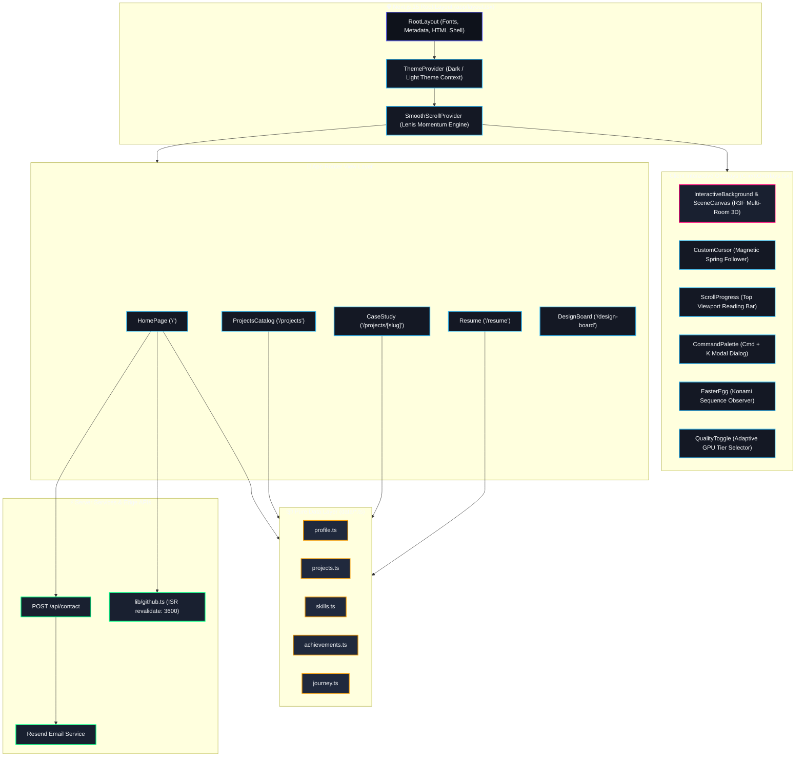
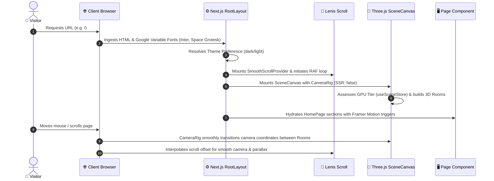
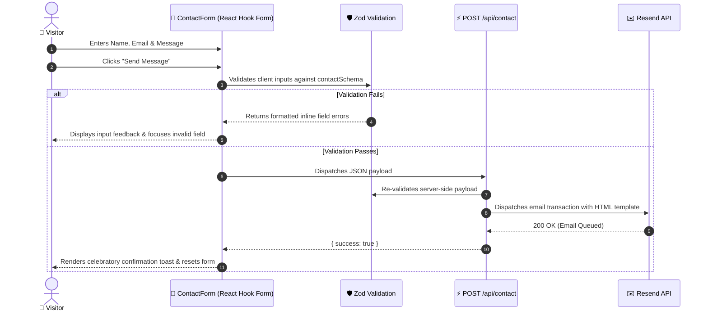

<div align="center">

<!-- ═══════════════════════════════════════════════════════════════════════════ -->
<!-- VIBRANT ANIMATED HEADER BANNER                                             -->
<!-- ═══════════════════════════════════════════════════════════════════════════ -->


<!-- Animated Dynamic Typing Title -->
<a href="https://github.com/Parthparthu">
  
</a>

<br/>

<!-- Colorful Tech & Status Badges -->
<a href="https://github.com/Parthparthu">
  
</a>


<br/><br/>

<!-- Real-time Metrics & Badges -->

&nbsp;

&nbsp;

&nbsp;


</div>

<!-- Animated Rainbow Divider Line -->


<!-- ═══════════════════════════════════════════════════════════════════════════ -->
<!-- QUICK NAVIGATION STRIP                                                     -->
<!-- ═══════════════════════════════════════════════════════════════════════════ -->
<div align="center">

| 🌐 [**Live Portfolio**](#-overview--philosophy) | 📖 [**Features**](#-features-breakdown) | 🔬 [**How It Works**](#-how-it-works-architecture) | 🚀 [**How To Use**](#-how-to-use-step-by-step-guide) | 🏆 [**Projects**](#-featured-projects-showcased) | 🎮 [**Easter Egg**](#-secret-konami-easter-egg--keyboard-shortcuts) |
|:---:|:---:|:---:|:---:|:---:|:---:|

</div>

<!-- Animated Rainbow Divider Line -->


<div align="center">

## 🌌 Overview & Philosophy

</div>

> *"Building software from first principles — understanding how bits flow through protocols, how graphics compute in parallel on the GPU, while obsessing over client performance, fluid micro-interactions, and pristine accessibility."*

This repository houses **Pradyumna's v2.0 Developer Portfolio** — a production-grade, spatial web experience engineered with **Next.js 15 (App Router & Turbopack)**, **React 19**, **Three.js / React Three Fiber**, and **Tailwind CSS**.

Far more than a simple showcase, it functions as a **living technical benchmark**: featuring a 3D spatial multi-room canvas, custom SVG liquid glass displacement shaders, adaptive GPU tier scaling, a hardware-accelerated magnetic cursor, a global keyboard command palette (`Cmd + K`), an interactive secret Konami code Easter Egg, dynamic case study routes (`/projects/[slug]`), a live Design System Showroom (`/design-board`), and an Edge-compatible contact dispatch pipeline powered by **Resend** and **Zod**.

<!-- Animated Rainbow Divider Line -->


<div align="center">

## ✨ Features Breakdown

</div>

<div align="center">

### 🎨 Visuals, Spatial 3D & Liquid Glass Shaders

</div>

<table>
<tr>
<td width="50%">

#### 🌐 3D Spatial Multi-Room Canvas
- Immersive 3D scene built with **React Three Fiber** and **Drei**.
- **Cinematic CameraRig**: Smooth camera interpolation tracking viewport scroll through themed spatial rooms:
  - 🦸 `HeroRoom`: Floating spatial centerpiece
  - 💼 `WorkRoom`: Interactive 3D project showcase
  - ⚡ `SkillsRoom`: Floating spatial skill nodes
  - 🗺️ `JourneyRoom`: 3D milestone path
  - 📡 `ContactRoom`: Holographic signal beacon
- Ambient `ParticleDust` atmospheric field and optional post-processing (Bloom, Chromatic Aberration).

#### 🧪 Liquid Glass Design System
- Proprietary frosted glass shaders (`LiquidGlass.tsx`) utilizing SVG turbulence displacement filters (`GlassSVGFilter.tsx`).
- 5 distinct elevation tiers, chromatic refraction, specular edge highlights, and color tinting.
- Interactive component showroom accessible at **`/design-board`**.

</td>
<td width="50%">

#### 🎛️ Adaptive GPU Quality Scaling (`QualityToggle`)
- Real-time GPU quality controller with user override selector (High, Medium, Low, Off) managed via Zustand (`useSceneStore`).
- Automatic fallback from WebGL post-processing down to lightweight CSS glass on low-power devices.

#### 🧲 Magnetic Physics Cursor
- Custom cursor with spring-physics smoothing and fine-pointer (`@media (pointer: fine)`) detection.
- Automatically morphs, expands, and snaps to interactive targets.

#### 🃏 Dynamic Spotlight Cards
- Mouse-tracked radial gradient illumination (`rgba(99, 102, 241, 0.25)`) that calculates pointer coordinates in real-time.

#### 📜 Viewport Reading Progress Bar
- High-precision reading progress bar positioned along the top viewport edge.

</td>
</tr>
</table>

<div align="center">

### ⚡ Architecture, Performance & Productivity

</div>

<table>
<tr>
<td width="50%">

#### ⚡ Next.js 15 & Turbopack
- Built with the bleeding-edge Next.js 15 App Router architecture.
- Blazing hot module replacement (HMR) powered by Rust-based Turbopack.
- Strict TypeScript 5.7+ typing across all domain entities, props, and server actions.

#### 🌊 Lenis Smooth Scrolling Engine
- Physics-based smooth inertial scrolling via **Lenis** with zero layout jank.
- Fully synchronized with React lifecycle, modal overlays, and anchor hash scrolling.

#### ⌨️ Global Command Palette (`Cmd + K`)
- Instant keyboard navigation dialog allowing quick page switching, project filtering, social launching, and theme toggling with keyboard arrow navigation.

</td>
<td width="50%">

#### 🌓 Dual Theme Engine (Dark & Light)
- First-class dark and light themes with system preference detection and `localStorage` persistence.
- Fluid typography and color tokens specified with CSS custom variables.

#### 📬 Type-Safe Contact Pipeline (Resend + Zod)
- Dedicated `/api/contact` route running with schema validation via **Zod**.
- Transactional email delivery powered by **Resend** with rate-limiting resilience and graceful development fallbacks.

#### 📑 Interactive Resume Route (`/resume`)
- Dedicated `/resume` page featuring timeline breakdown, section jumping, skill badges, and one-click PDF printing.

</td>
</tr>
</table>

<!-- Animated Rainbow Divider Line -->


<div align="center">

## 🛠️ Tech Stack Matrix

</div>

<div align="center">

| Layer | Technologies | Purpose | Status |
|:---|:---|:---|:---:|
| **Core Framework** | `Next.js 15.0.3` · `React 19` | App Router, Server Components & Streaming SSR |  |
| **Language** | `TypeScript 5.7.2` | 100% strict type safety and interface modeling |  |
| **Styling & Design System** | `Tailwind CSS 3.4` · `@tailwindcss/typography` | Utility-first responsive design, fluid clamp typography |  |
| **3D & Canvas Graphics** | `Three.js` · `@react-three/fiber` · `@react-three/drei` | WebGL multi-room spatial scene & interactive canvas |  |
| **Liquid Glass Shaders** | SVG Displacement Filter · CSS Backdrop Filter | Chromatic dispersion, refractive specular highlights |  |
| **State Management** | `Zustand v5` | Lightweight reactive store for 3D scene & GPU tier |  |
| **Animation & Physics** | `Framer Motion 11` · `GSAP 3.12` | Layout transitions, spring physics, scroll-linked parallax |  |
| **Smooth Scrolling** | `Lenis 1.1.18` | Inertial momentum scrolling engine |  |
| **Icons & Typography** | `Lucide React` · Google Fonts (`Inter`, `Space Grotesk`, `JetBrains Mono`) | Vector UI iconography & variable typography |  |
| **Forms & Validation** | `React Hook Form 7` · `Zod 3.23` · `@hookform/resolvers` | Client & server schema validation |  |
| **Email API** | `Resend 4.0.1` | Transactional email transmission for contact queries |  |
| **Bundling & Tooling** | `Turbopack` · `PostCSS` · `Autoprefixer` | Instant HMR and asset compilation |  |

</div>

<br/>

<div align="center">

<!-- Tech Badges Carousel -->


</div>

<!-- Animated Rainbow Divider Line -->


<div align="center">

## 🔬 How It Works: Architecture

</div>

The portfolio is structured around a decoupled, reactive layer system separating **Presentation (Server & Client)**, **Global Overlays & 3D Spatial Canvas**, and **Static Data Ingestion**.

### 🏗️ System Hierarchy & Data Flow


```mermaid
graph TD
    %% Base Theme Styling
    classDef root fill:#0E121B,stroke:#6366F1,stroke-width:2px,color:#F8FAFC;
    classDef client fill:#141824,stroke:#38BDF8,stroke-width:2px,color:#F8FAFC;
    classDef three fill:#192030,stroke:#FF007A,stroke-width:2px,color:#F8FAFC;
    classDef api fill:#192030,stroke:#00FF88,stroke-width:2px,color:#F8FAFC;
    classDef data fill:#20293D,stroke:#F59E0B,stroke-width:2px,color:#F8FAFC;

    subgraph Core ["🌐 Next.js 15 Root Layout (app/layout.tsx)"]
        A["RootLayout (Fonts, Metadata, HTML Shell)"]:::root
        B["ThemeProvider (Dark / Light Theme Context)"]:::client
        C["SmoothScrollProvider (Lenis Momentum Engine)"]:::client
    end

    subgraph Overlays ["✨ Client Interactive Overlays (ClientOverlays.tsx)"]
        D["InteractiveBackground & SceneCanvas (R3F Multi-Room 3D)"]:::three
        E["CustomCursor (Magnetic Spring Follower)"]:::client
        F["ScrollProgress (Top Viewport Reading Bar)"]:::client
        G["CommandPalette (Cmd + K Modal Dialog)"]:::client
        H["EasterEgg (Konami Sequence Observer)"]:::client
        I["QualityToggle (Adaptive GPU Tier Selector)"]:::client
    end

    subgraph Pages ["📄 App Router View Layer"]
        P1["HomePage ('/')"]:::client
        P2["ProjectsCatalog ('/projects')"]:::client
        P3["CaseStudy ('/projects/[slug]')"]:::client
        P4["Resume ('/resume')"]:::client
        P5["DesignBoard ('/design-board')"]:::client
    end

    subgraph Backend ["⚡ Server Services & Edge APIs"]
        API["POST /api/contact"]:::api
        RSND["Resend Email Service"]:::api
        GH["lib/github.ts (ISR revalidate: 3600)"]:::api
    end

    subgraph StaticData ["📦 Pure Data Layer (data/*.ts)"]
        D1["profile.ts"]:::data
        D2["projects.ts"]:::data
        D3["skills.ts"]:::data
        D4["achievements.ts"]:::data
        D5["journey.ts"]:::data
    end

    A --> B --> C
    C --> Pages
    C --> Overlays
    P1 --> StaticData
    P2 --> StaticData
    P3 --> StaticData
    P4 --> StaticData
    P1 --> API --> RSND
    P1 --> GH
```

---

### 🔄 Hydration & Runtime Lifecycle


```mermaid
sequenceDiagram
    autonumber
    actor User as 👤 Visitor
    participant Browser as 🌐 Client Browser
    participant Layout as ⚙️ Next.js RootLayout
    participant Lenis as 🌊 Lenis Scroll
    participant WebGL as 🌌 Three.js SceneCanvas
    participant View as 🖥️ Page Component

    User->>Browser: Requests URL (e.g. /)
    Browser->>Layout: Ingests HTML & Google Variable Fonts (Inter, Space Grotesk)
    Layout->>Layout: Resolves Theme Preference (dark/light)
    Layout->>Lenis: Mounts SmoothScrollProvider & initiates RAF loop
    Layout->>WebGL: Mounts SceneCanvas with CameraRig (SSR: false)
    WebGL->>WebGL: Assesses GPU Tier (useSceneStore) & builds 3D Rooms
    Layout->>View: Hydrates HomePage sections with Framer Motion triggers
    User->>Browser: Moves mouse / scrolls page
    Browser->>WebGL: CameraRig smoothly transitions camera coordinates between Rooms
    Browser->>Lenis: Interpolates scroll offset for smooth camera & parallax
```

---

### 🧪 Liquid Glass Refraction & Shader Architecture

The `LiquidGlass` system creates physical depth without standard heavyweight shaders:
1. **SVG Displacement Map**: `GlassSVGFilter.tsx` defines an SVG filter `<feTurbulence type="fractalNoise">` feeding into `<feDisplacementMap>` to simulate micro-imperfections in polished glass.
2. **Backdrop Blur & Dual Border**: Uses modern `backdrop-filter: blur(16px)` combined with semi-transparent specular edges (`rgba(255, 255, 255, 0.16)`).
3. **Dynamic Elevation Tiers**: Supports 5 elevation levels scaling shadow spread and refraction index.
4. **Hardware Adaptation**: Automatically scales back to simplified CSS opacity when `QualityToggle` is set to Low or Off.

---

### 📬 Type-Safe Contact Pipeline Sequence


```mermaid
sequenceDiagram
    autonumber
    actor Visitor as 👤 Visitor
    participant Form as 📝 ContactForm (React Hook Form)
    participant Zod as 🛡️ Zod Validation
    participant Route as ⚡ POST /api/contact
    participant Resend as ✉️ Resend API

    Visitor->>Form: Enters Name, Email & Message
    Visitor->>Form: Clicks "Send Message"
    Form->>Zod: Validates client inputs against contactSchema
    alt Validation Fails
        Zod-->>Form: Returns formatted inline field errors
        Form-->>Visitor: Displays input feedback & focuses invalid field
    else Validation Passes
        Form->>Route: Dispatches JSON payload
        Route->>Zod: Re-validates server-side payload
        Route->>Resend: Dispatches email transaction with HTML template
        Resend-->>Route: 200 OK (Email Queued)
        Route-->>Form: { success: true }
        Form-->>Visitor: Renders celebratory confirmation toast & resets form
    end
```

<!-- Animated Rainbow Divider Line -->


<div align="center">

## 🚀 How To Use: Step-by-Step Guide

</div>

### 📋 Prerequisites

Ensure your environment satisfies the following minimum runtime requirements:

| Tool | Required Version | Recommended | Verification Command |
|:---|:---:|:---:|:---|
| **Node.js** | `>= 18.18.0` | `v20.x LTS` or `v22.x` | `node -v` |
| **pnpm** (preferred) | `>= 8.x` | `pnpm v9+` | `pnpm -v` |
| **npm** (fallback) | `>= 9.x` | `npm v10+` | `npm -v` |

---

### ⚡ Quickstart (One-Liner)

```bash
git clone https://github.com/Parthparthu/Portfolio.git && cd Portfolio && pnpm install && pnpm dev
```

---

### 1️⃣ Clone the Repository

```bash
# Clone via HTTPS
git clone https://github.com/Parthparthu/Portfolio.git

# Navigate into project directory
cd Portfolio
```

---

### 2️⃣ Install Dependencies

Using **pnpm** (recommended for speed and disk-space optimization):

```bash
pnpm install
```

*Or using npm:*
```bash
npm install
```

---

### 3️⃣ Configure Environment Variables

Create your local environment file by copying the template:

```bash
# On Linux / macOS / Git Bash
cp .env.example .env.local

# On Windows PowerShell
Copy-Item .env.example .env.local
```

Open `.env.local` in your editor and configure:

```env
# ==============================================================================
# PRADYUMNA DEVELOPER PORTFOLIO - LOCAL ENVIRONMENT CONFIG
# ==============================================================================

# Resend API Key for contact form mail delivery (Get one at https://resend.com)
# (Leave blank in development to test UI without sending real emails)
RESEND_API_KEY=re_your_api_key_here

# Recipient email where contact form submissions will be delivered
CONTACT_EMAIL=your-email@example.com

# Public Site URL for canonical meta tags & OpenGraph preview cards
NEXT_PUBLIC_SITE_URL=http://localhost:3000

# Optional GitHub Personal Access Token to raise rate limits from 60 to 5000 req/hr
GITHUB_TOKEN=
```

---

### 4️⃣ Launch Development Server (with Turbopack)

Start the high-speed Turbopack development server:

```bash
pnpm dev
```

> ⚡ Turbopack compiles pages on-demand in milliseconds! Open your browser and navigate to:
> **`http://localhost:3000`**

---

### 5️⃣ Quality Verification & Type Checking

Verify that all TypeScript code passes strict mode checks without compilation errors:

```bash
# Run TypeScript compilation check
pnpm typecheck

# Run Next.js linting checks
pnpm lint
```

---

### 6️⃣ Build & Run for Production

Compile optimized production server bundles and test locally:

```bash
# Build optimized Next.js production bundle
pnpm build

# Start local production server
pnpm start
```

---

### 7️⃣ Deployment Guidelines

#### Deploying to **Vercel** (Recommended)
1. Push your repository to GitHub.
2. Visit [Vercel Dashboard](https://vercel.com/new) and import `Portfolio`.
3. Set Framework Preset to **Next.js**.
4. In **Environment Variables**, add:
   - `RESEND_API_KEY`
   - `CONTACT_EMAIL`
   - `NEXT_PUBLIC_SITE_URL`
5. Click **Deploy**. Vercel will build and assign your production domain.

#### Deploying via **Docker / Self-Hosted**
Build a standalone container using Node.js:
```dockerfile
FROM node:20-alpine AS runner
WORKDIR /app
COPY . .
RUN npm install -g pnpm && pnpm install --frozen-lockfile
RUN pnpm build
EXPOSE 3000
CMD ["pnpm", "start"]
```

<!-- Animated Rainbow Divider Line -->


<div align="center">

## 🏆 Featured Projects Showcased

</div>

<table>
<tr>
<td width="50%" align="top">

### 🌀 [Oweo](https://oweo.vercel.app)
> **Offline-First Expense Tracking & Debt Minimization PWA**

```
Status: Production  •  Tier: Tier A  •  Role: Solo Developer
```

- **Stack**: `React 19` · `TypeScript` · `Zustand` · `IndexedDB` · `Firebase` · `PWA`
- **Core Problem**: Most expense apps fail when offline, resulting in lost receipts and broken group accounting while traveling.
- **Engineered Solution**: True offline-first client architecture using **IndexedDB** as the primary source of truth, backed by **Firebase Firestore** for opportunistic cloud sync and a graph-based debt simplification algorithm.
- **Key Metrics**: `100% Offline Capability` · `<1.2s FCP` · `95+ Lighthouse Score`

<div align="center">

[](https://github.com/Parthparthu/Oweo)
[](https://oweo.vercel.app)

</div>

</td>
<td width="50%" align="top">

### 🔢 [Numora](https://github.com/Parthparthu/Numora)
> **Pure TypeScript Numerology Engine with 3D Spatial Visuals**

```
Status: Production  •  Tier: Tier A  •  Role: Solo Developer & Designer
```

- **Stack**: `React 19` · `TypeScript` · `Three.js` · `React Three Fiber` · `Framer Motion`
- **Core Problem**: Existing numerology calculators rely on black-box external formulas with no algorithmic transparency and clunky interfaces.
- **Engineered Solution**: Framework-agnostic pure TypeScript calculation core executing 43 directional pattern scans, paired with an interactive 3D digit field rendered in WebGL.
- **Key Metrics**: `100% Core Test Coverage` · `Zero External Math Libraries`

<div align="center">

[](https://github.com/Parthparthu/Numora)
[](https://github.com/Parthparthu/Numora)

</div>

</td>
</tr>
<tr>
<td width="50%" align="top">

### 📈 [InsiderTracker](https://github.com/Parthparthu/InsiderTracker)
> **Real-Time SEC EDGAR Form 4 Financial Data Engine**

```
Status: Production  •  Tier: Tier A  •  Role: Solo Backend & Full-Stack Developer
```

- **Stack**: `Python` · `FastAPI` · `React` · `TypeScript` · `SEC EDGAR API` · `Recharts`
- **Core Problem**: Institutional insider filings are locked behind multi-thousand-dollar terminal paywalls or buried in raw XML feeds.
- **Engineered Solution**: Asynchronous FastAPI pipeline ingesting SEC EDGAR RSS XML filings, normalizing complex derivative/non-derivative tables, and surfacing high-conviction C-suite trades (>$500K).
- **Key Metrics**: `4 Custom REST Endpoints` · `Automated Form 4 XML Parsing`

<div align="center">

[](https://github.com/Parthparthu/InsiderTracker)

</div>

</td>
<td width="50%" align="top">

### ⚔️ [CodeClash AI](https://github.com/Parthparthu/CodeClash-AI)
> **1v1 Live Competitive Coding Battle Platform with AI Opponents**

```
Status: Prototype  •  Tier: Tier A  •  Role: Systems Architect
```

- **Stack**: `Next.js` · `TypeScript` · `FastAPI` · `Supabase` · `WebSockets` · `Monaco Editor`
- **Core Problem**: Traditional algorithm practice platforms are solitary and lack the thrill of real-time competitive matchmaking.
- **Engineered Solution**: Full-stack head-to-head arena utilizing bi-directional WebSockets for real-time keystroke synchronization, sandboxed code execution, and ELO rating adjustments.
- **Key Metrics**: `Real-time WebSocket Sync` · `Sandboxed Execution Guardrails`

<div align="center">

[](https://github.com/Parthparthu/CodeClash-AI)

</div>

</td>
</tr>
</table>

<!-- Animated Rainbow Divider Line -->


<div align="center">

## 📊 Live GitHub Activity & Statistics

</div>

<div align="center">

<!-- GitHub Stats with Cyberpunk/Radical Theme -->

&nbsp;


<br/><br/>

<!-- GitHub Streak Stats -->


</div>

<!-- Animated Rainbow Divider Line -->


<div align="center">

## 🧠 Engineering Skills Matrix

</div>

<div align="center">

```
┌─────────────────────────────────────────────────────────────────────────────┐
│                       TECHNICAL CAPABILITIES & PROFICIENCY                  │
├─────────────────────────┬───────────────────────────────────────────────────┤
│ ◈ CORE LANGUAGES        │ Python (FastAPI, Pandas, Algorithms)              │
│                         │ TypeScript (Strict, Generics, Engine Design)      │
│                         │ JavaScript (ESNext, WebSockets, DOM APIs)         │
│                         │ SQL (Schema Design, Joins, PostgreSQL)            │
│                         │ C / C++ (Low-Level Memory & Academic Computing)   │
├─────────────────────────┼───────────────────────────────────────────────────┤
│ ◈ FRONTEND ARCHITECTURE │ Next.js 15 (App Router, Turbopack, SSR, Server)   │
│                         │ React 19 (Hooks, Suspense, Concurrent Features)   │
│                         │ Three.js & React Three Fiber (R3F, WebGL Shaders) │
│                         │ Framer Motion 11 & GSAP (Spatial Micro-Physics)   │
│                         │ Tailwind CSS 3.4 (Design Tokens, Fluid Clamp)     │
│                         │ Liquid Glass System (SVG Displacement & Shaders)  │
│                         │ Progressive Web Apps (Service Workers, Cache APIs)│
├─────────────────────────┼───────────────────────────────────────────────────┤
│ ◈ BACKEND & SYSTEMS     │ FastAPI (Async Workers, Pydantic Schema Contracts)│
│                         │ WebSockets (Real-Time Bi-Directional Streaming)   │
│                         │ Resend (Edge Transactional Mail Routing)          │
│                         │ Sandboxed Code Evaluation & Execution Engines     │
├─────────────────────────┼───────────────────────────────────────────────────┤
│ ◈ DATABASES & PERSISTENCE│ PostgreSQL / Supabase (Row-Level Security, Realtime│
│                         │ IndexedDB & Zustand v5 (Client-Side Storage Slices│
│                         │ SQLite (Embedded Relational ACID Transactions)    │
│                         │ Firebase Firestore (NoSQL Document Cloud Datastore│
├─────────────────────────┼───────────────────────────────────────────────────┤
│ ◈ DEVOPS & METHODOLOGIES│ Git & GitHub Workflows • GitHub Actions CI/CD     │
│                         │ Linux CLI • Turbopack • Vitest • PostCSS • Zod    │
│                         │ WAI-ARIA APG Accessibility • SEO & OpenGraph Audit │
└─────────────────────────┴───────────────────────────────────────────────────┘
```

</div>

<!-- Animated Rainbow Divider Line -->


<div align="center">

## 🗓️ Engineering Journey & Milestones

</div>

```
2020  ● First Principles & Creative Computing
      │  Began programming with canvas animations, 2D physics engines & interactive simulations.
      │
2021  ● World Memory Championship — 🥉 Bronze Medalist
  ↓   │  Disciplined 2-year training in high-speed pattern recognition & spatial indexing (Method of Loci).
2022  │  Built intense mental stamina, structural data structuring & pressure tolerance.
      │
2023  ● B.Tech in CSE (Artificial Intelligence & Machine Learning)
      │  Undergraduate engineering at GL Bajaj Institute of Technology & Management.
      │  Deep focus on Data Structures, Algorithms, Discrete Math & Operating Systems.
      │
2024  ● Full-Stack Systems & Financial Engineering
      │  Built BilingSystem (desktop retail ERP), BreakoutScanner (3D financial visualizer),
      │  and architected full-stack Next.js applications.
      │
2025  ● Flagship Systems & Spatial Web Experiences
      │  Shipped Oweo (offline-first PWA), Numora (pure TypeScript 3D engine),
  →   │  InsiderTracker (FastAPI SEC EDGAR data engine), and CodeClash AI (1v1 live coding MVP).
```

<!-- Animated Rainbow Divider Line -->


<div align="center">

## 🎮 Secret Konami Easter Egg & Keyboard Shortcuts

</div>

This portfolio is packed with hidden developer easter eggs and power-user keyboard shortcuts!

<div align="center">

| Shortcut | Action | Description |
|:---:|:---|:---|
| <kbd>Cmd</kbd> + <kbd>K</kbd> / <kbd>Ctrl</kbd> + <kbd>K</kbd> | **Command Palette** | Opens global spotlight search to jump to pages, projects, or switch themes. |
| <kbd>↑</kbd> <kbd>↑</kbd> <kbd>↓</kbd> <kbd>↓</kbd> <kbd>←</kbd> <kbd>→</kbd> <kbd>←</kbd> <kbd>→</kbd> <kbd>B</kbd> <kbd>A</kbd> | **Konami Secret Code** | Triggers celebratory modal honoring the **World Memory Championship Bronze Medal**! |
| <kbd>Esc</kbd> | **Close Modal** | Instantly dismisses Command Palette or Easter Egg overlays. |
| <kbd>Tab</kbd> | **Skip to Content** | APG-compliant accessible keyboard navigation bypass. |

</div>

<!-- Animated Rainbow Divider Line -->


<div align="center">

## 🗂️ Project Directory Structure

</div>

```
Portfolio/
├── 📁 app/                             # Next.js 15 App Router Root
│   ├── 📁 api/
│   │   └── 📁 contact/
│   │       └── route.ts               # Edge-compatible contact API via Resend & Zod
│   ├── 📁 design-board/
│   │   └── page.tsx                   # Liquid Glass showroom & design token explorer
│   ├── 📁 projects/
│   │   ├── 📁 [slug]/
│   │   │   └── page.tsx               # Dynamic Static-Generated Case Studies
│   │   ├── page.tsx                   # Projects catalog route
│   │   └── ProjectsPageClient.tsx     # Filterable project gallery with active tags
│   ├── 📁 resume/
│   │   └── page.tsx                   # Interactive & printable developer resume
│   ├── globals.css                    # Fluid typography clamp scale, theme tokens & keyframes
│   ├── layout.tsx                     # RootLayout (Fonts, Metadata, Shell & Overlays)
│   ├── loading.tsx                    # Suspense loading boundary
│   ├── not-found.tsx                  # Custom animated 404 page
│   ├── page.tsx                       # Home page composing all sections
│   ├── robots.ts                      # Dynamic search engine robots generator
│   └── sitemap.ts                     # Dynamic XML sitemap generator
├── 📁 components/                      # Modular Component Hierarchy
│   ├── 📁 3d/
│   │   └── InteractiveBackground.tsx  # Fallback WebGL particle constellation canvas
│   ├── 📁 canvas/                      # Multi-Room R3F 3D Canvas
│   │   ├── CameraRig.tsx              # Scroll-interpolated cinematic camera rig
│   │   ├── HeroRoom.tsx               # Hero spatial 3D centerpiece
│   │   ├── WorkRoom.tsx               # 3D project gallery room
│   │   ├── SkillsRoom.tsx             # 3D skill node cloud
│   │   ├── JourneyRoom.tsx            # 3D career timeline path
│   │   ├── ContactRoom.tsx            # 3D signal beacon
│   │   ├── ParticleDust.tsx           # Floating ambient particle dust
│   │   ├── PostProcessing.tsx         # Bloom, chromatic aberration & vignette
│   │   └── SceneCanvas.tsx            # Main R3F Canvas controller
│   ├── 📁 common/
│   │   ├── ClientOverlays.tsx         # Lazy client overlay loader
│   │   └── SmoothScrollProvider.tsx   # Lenis smooth inertial scrolling wrapper
│   ├── 📁 glass/                       # Liquid Glass Shader Primitives
│   │   ├── GlassSVGFilter.tsx         # SVG turbulence & displacement filter
│   │   ├── GlassVariants.tsx          # Card, Pill, Button, Input glass variants
│   │   └── LiquidGlass.tsx            # Core glass component with 5 elevation tiers
│   ├── 📁 layout/
│   │   ├── Header.tsx                 # Dynamic sticky blur navbar with mobile menu
│   │   ├── Footer.tsx                 # Site footer with social links & copyright
│   │   └── Preloader.tsx              # Cinematic boot sequence preloader
│   ├── 📁 sections/                   # Home Page Section Blocks
│   │   ├── HeroSection.tsx            # Animated Hero with rotating roles & magnetic CTAs
│   │   ├── AboutSection.tsx           # Philosophy & background narrative
│   │   ├── SkillsSection.tsx          # 6-category verified skill grid
│   │   ├── SelectedWork.tsx           # Featured project showcases
│   │   ├── CurrentlyBuilding.tsx      # Active WIP prototypes
│   │   ├── AchievementsSection.tsx    # WMC Bronze, academic merit & GitHub awards
│   │   ├── JourneySection.tsx         # Chronological career milestones
│   │   ├── GitHubSection.tsx          # Live GitHub profile stats & repositories
│   │   └── ContactSection.tsx         # Validated contact form with interactive states
│   └── 📁 ui/                         # Atomic Reusable UI Primitives
│       ├── BackToTop.tsx              # Scroll-aware return to top trigger
│       ├── CommandPalette.tsx         # Cmd+K fuzzy navigation dialog
│       ├── CustomCursor.tsx           # Magnetic spring-physics cursor follower
│       ├── EasterEgg.tsx              # Konami code modal activator
│       ├── QualityToggle.tsx          # Real-time GPU quality tier controller
│       ├── ScrollProgress.tsx         # Viewport top reading progress bar
│       ├── SpotlightCard.tsx          # Mouse-tracked radial gradient card
│       ├── ThemeProvider.tsx          # Dark/Light theme provider with local storage
│       └── ThemeToggle.tsx            # Animated theme switcher button
├── 📁 data/                           # Immutable Static Content Engine
│   ├── achievements.ts                # Awards, recognitions & cognitive discipline
│   ├── journey.ts                     # Chronological milestones from 2020 to present
│   ├── profile.ts                     # Bio, education details, and focus areas
│   ├── projects.ts                    # In-depth case studies with problem/solution specs
│   ├── skills.ts                      # 6 Categorized skill groups with verified proof
│   └── socials.ts                     # Social accounts & communication endpoints
├── 📁 lib/                            # Shared Utilities & External Services
│   ├── github.ts                      # GitHub API fetching with ISR revalidation
│   └── utils.ts                       # Classnames merger & text formatting helpers
├── 📁 store/                          # Global Client State Management
│   └── useSceneStore.ts               # Zustand store for 3D scene & GPU tier overrides
├── 📁 types/                          # Global TypeScript Definitions
│   ├── profile.ts                     # Profile, Achievement & Milestone interfaces
│   └── project.ts                     # CaseStudy, Metric & Project interfaces
├── 📁 public/                         # Static Assets
│   ├── favicon.svg                    # Vector brand mark
│   └── resume.pdf                     # Downloadable developer resume
├── .env.example                       # Environment template documentation
├── package.json                       # Next.js 15, React 19, dependencies & scripts
├── postcss.config.mjs                 # PostCSS plugin configurations
├── tailwind.config.ts                 # Tailwind design tokens, colors & plugins
└── tsconfig.json                      # Strict TypeScript compiler options
```

<!-- Animated Rainbow Divider Line -->


<div align="center">

## ❓ Frequently Asked Questions (FAQ)

</div>

<details>
<summary><b>🔍 How does the contact form work without a traditional backend server?</b></summary>
<br/>
The contact form submits directly to the Next.js 15 Edge-compatible Route Handler at <code>app/api/contact/route.ts</code>. The payload is first validated by <b>Zod</b> schemas on both client and server. If valid, it dispatches an email via the <b>Resend</b> API. In local environments where no <code>RESEND_API_KEY</code> is configured, the route logs the submission to the terminal and returns a successful response so the frontend flow can be tested without errors.
</details>

<details>
<summary><b>🎨 Can I customize the neon color scheme?</b></summary>
<br/>
Yes! All brand and accent colors are configured as CSS custom variables in <code>app/globals.css</code> (e.g. <code>--brand-cobalt</code>, <code>--brand-cyan</code>, <code>--accent-primary</code>, <code>--accent-emerald</code>) and mapped directly into <code>tailwind.config.ts</code>. Modifying these tokens instantly updates the entire UI across dark and light modes.
</details>

<details>
<summary><b>📱 How does the GPU Quality Tier system work?</b></summary>
<br/>
The portfolio features an adaptive GPU tier management system built into <code>store/useSceneStore.ts</code> and exposed via <code>QualityToggle.tsx</code>. It detects device capabilities and lets users manually toggle between:
<ul>
  <li><b>High</b>: Full 3D multi-room canvas, post-processing shaders, bloom & particle dust.</li>
  <li><b>Medium</b>: Simplified 3D geometry without post-processing.</li>
  <li><b>Low</b>: Pure CSS liquid glass without WebGL rendering.</li>
  <li><b>Off</b>: Completely static view with zero animations for battery saving.</li>
</ul>
</details>

<!-- Animated Rainbow Divider Line -->


<div align="center">

## 📄 License & Attribution

</div>

<div align="center">

This project is open-source under the **MIT License**. You are free to explore, learn from, and adapt this architecture for your personal projects. If you find it helpful, giving a star ⭐ is always appreciated!

<br/>

<!-- Animated Footer Wave -->


### Crafted with ❤️ & High-Velocity Engineering by **[Pradyumna](https://github.com/Parthparthu)**

*B.Tech CSE (AI/ML) · Full-Stack Architect · World Memory Championship Bronze Medalist*

[](https://github.com/Parthparthu)
[](https://github.com/Parthparthu)

</div>
